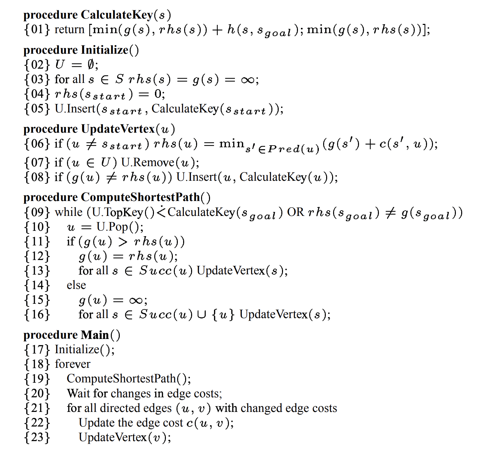
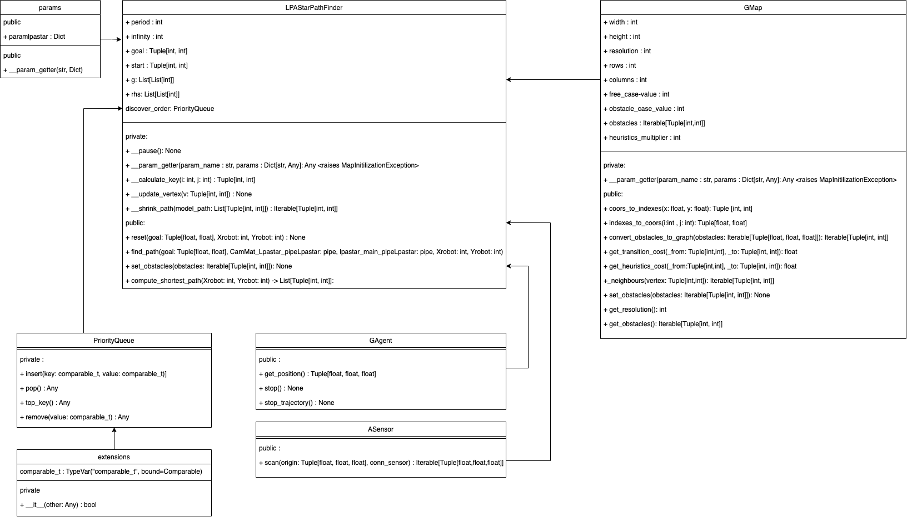

# LPAStar - Path Finder

This repository contains a LPA* algorithm implementation for the French robotic national cup. Below, you have the basic explanation of the algorithm, the architecture of the project and the documentation

# What is LPA*?

LPA* is an algorithm which allows us to find the shortest path from the start vertex to the goal vertex. It proceeds exactly as A*, but is adapted to the dynamic changes of the map in condition that the map is known at every instant of time.

The implementation of this algorithm is based on the [***Sven Koeing, Maxim Likhachev D\* Lite***](http://idm-lab.org/bib/abstracts/papers/aaai02b.pdf) paper. Here is a pseudocode and intuitive explanation of the algorithm:

## Pseudocode

---

## Algorithm Explanation

---

***Three functions:***
----------------------

LPA* uses 3 functions **g**, **rhs** and **h**.

1. **g(s)** represents the minimal distance from  to *s*.
2. **rhs(s)** is a one-step lookup based on **g** values. &space;=&space;&space;min_{s'&space;\in&space;{Pred(s)}}[g(s')&space;&plus;&space;c(s',&space;s)]&space;\&space;and&space;\&space;rhs(s_{start})&space;=&space;0), where *c(s', s)* is a transition cost from *s'* to *s*. **rhs** has more information and influences the expansion of the vertices.
3. **h(s, s')** is a heuristics. It is used by LPA* to expand only on vertices "which make sense" before expand on the other vertices if the obstacles are present on the way.

***Main routine:***
-------------------

***Main*** function initializes all variables that matter for path-finding. It assigns all ***g-values*** and ***rhs-values*** to infinity and then puts &space;=&space;0). Then, while our agent (robot for example) does not reach the goal we compute the shortest path with current map configuration. We rescan the full map then and we update each vertex for which the edge cost has been changed.

***Update vertex***
-------------------

***UpdateVertex*** function recalculates the ***rhs-value*** of the vertex using the following formula: &space;=&space;&space;min_{s'&space;\in&space;{Pred(s)}}[g(s')&space;&plus;&space;c(s',&space;s)]&space;\&space;and&space;\&space;rhs(s_{start})&space;=&space;0). Then it removes the vertex from priority queue and reinserts it if ***g-value*** of the vertex is not equal to its ***rhs-value*** (there is possible optimization).

## Architecture and documentation

---

Here is the UML-diagram of the project that can help you in better understanding of the architecture:

***class GAgent.GAgent***
-------------------

A class which contains robot’s methods to implement for path finding. 

worker: mp.Process
A worker process to run agent’s movement methods

get_position():
Retreives the position of the agent in [x, y, alpha] format, where (x, y) are the coordinates of the agent and alpha is its orientation.

stop():
Stops the agent.

***__init__()***
Initializes robot’s worker process to None.

***get_position() → Tuple[float, float, float]***
Gets agent’s position.

Returns:
Tuple[float, float, float]: The position of the agent in [x, y, alpha] format, where (x, y) are the coordinates of the agent and alpha is its orientation

***stop() → None***
Stops all movements of the agent

***stop_trajectory() → None***
Prevents agent from continuing the trajectory. Kills the worker process to stop giving movement commands. Sends a stop command to the agent.

***class ASensor.ASensor***
-------------------

class ASensor that simulates any sensor.

***scan(origin: Tuple[float, float, float], conn_sensor: pipe()) → Iterable[Tuple[float, float, float]]***
Scans the environment according to the sensor position and returns a list of obstacles.

Args:
origin (Tuple[float, float, float]):
The position of the sensor in the [x, y, alpha] format, where (x, y) are the coordinates of the sensor and alpha is its orientation. It is used to transform relative obstacles’ coordinates to absolute coordinates compared to map’s origin.

Returns:
Iterable[Tuple[float, float, float]]: An Iterable(list generally) of the obstacles in the [x, y, w] format, where (x, y) are the absolute coordinates of the center of an obstacle and w is its width

***class GMap.GMap***
-------------------

***class GMap.GMap(params: Dict[str, int], obstacles: Optional[Iterable[Tuple[float, float, float]]] = None)***
A class that represents a map. User must provide attributes values in chosen units and respect the convention. This class allows to represent a 2D environment as a non-oriented graph where each vertex corresponds to the center of the square case with resolution x resolution dimensions. The adjacent cases are modelized by adjecent vertices.

There is only 2 types of vertices: free vertices and obstacle vertices. We maintain only the list of obstacles and we use get_transition_cost to retreive the edge cost and get_heuristics_cost to retreive the heuristics cost.

width: int
The width of the map.

height: int
The height if the map.

resolution: int
The dimension of the square case representable by a vertex.

rows: int
Number of cases’ rows in map representation.

columns: int
Number of cases’ columns in map representation.

free_case_value: int
A multiplier for a transition from free case to the another free case.

obstacle_case_value: int
A multiplier for a transition from or to the obstacle case.

obstacles: Iterable[Tuple[int, int]]
A list of obstacles represented by theirs indices (i, j)

heuristics_multiplier: int
A multiplier for a heuristics transition cost.

__param_getter(param_name, params):
Helper function, which allows to get information from a dictionary given in parameters.

coors_to_indexes(x, y):
Helper function used to convert real life coordinates to their graph representation.

indexes_to_coors(i, j):
Helper function used to convert graph representation indices to the real life coordinates.

convert_obstacles_to_graph(obstacles):
Helper function which allows create graph representation obstacles from real life obstacles according to their width.

get_transition_cost(_from, _to):
Gets the edge cost from vertex _from to the vertex _to.

get_neighbours(vertex):
Gets neighbours of the vertex.

get_heuristics_cost(_from, _to):
Gets the heuristics cost from vertex _from to the vertex _to.

get_resolution():
Gets the resolution.

get_obstacles():
Gets all obstacles.

set_obstacles(obstacles):
Sets obstacles.

***__init__(params: Dict[str, int], obstacles: Optional[Iterable[Tuple[float, float, float]]] = None) → None***
Uses __param_getter method to extract data from dictionary. Initializes obstacles if provided.

Args:
obstacles=None (Iterable[Tuple[float, float, float]]):
A list of real life obstacles.

params (Dict[str, int]):
A dictionary with attributes to initialize.

***__param_getter(param_name: str, params: Dict[str, Any]) → Any***
A function which is used to extract data from dictionary and verify that all
required arguments have been provided.

Args:
param_name (str):
A name of an argument to extract.

params (Dict[str, Any]):
A dictionary to extract from.

Raises:
MapInitializationException: Occurs when the required argument is missing

Returns:
Any: A value extracted from params associated to the key param_name

***convert_obstacles_to_graph(obstacles: Iterable[Tuple[float, float, float]]) → Iterable[Tuple[int, int]]***
Converts real life obstacles to theirs’ graph representation. Obstacles’ representations as graph have no width,
they occupy only graph cases/vertices.

Args:
obstacles (Iterable[Tuple[float, float, float]]):
Real life obstacles in [x, y, w] format, where (x, y) are obstacle’s coordinates and w is its width

Returns:
Iterable[Tuple[int ,int]]: Graph representation of the obstacles.

***coors_to_indexes(x: float, y: float) → Tuple[int, int]***
Converts real life coordinates to the indices of the graph’s vertex

Args:
x (float):
Real life x coordinate

y (float):
Real life y coordinate

Returns:
Tuple[int, int]: Indices of the graph’s vertex which corresponds to the (x, y)

***get_heurisitcs_cost(_from: Tuple[int, int], _to: Tuple[int, int]) → float***
Gets heuristics cost to go from _from to _to

Args:
_from (Tuple[int, int]):
A vertex to go from

_to (Tuple[int, int]):
A vertex to go to

Returns:
float: The heuristics cost from _from to _to

***get_neighbours(vertex: Tuple[int, int]) → Iterable[Tuple[int, int]]***
Gets all neighbours of the vertex

Args:
vertex (Tuple[int, int]):
The vertex to get neighbours of

Returns:
Iterable[Tuple[int, int]]: Neighbours of the vertex

***get_obstacles() → Iterable[Tuple[int, int]]***
Gets the list of current obstacles on the map

Returns:
Iterable[Tuple[int, int]]: A list of obstacles

***get_resolution() → int***
Gets the resolution

Returns:
int: The resolution of the map

***get_transition_cost(_from: Tuple[int, int], _to: Tuple[int, int]) → float***
Gets a transition cost between _from and _to vertex if and only if they are neighbours.

Args:
_from (Tuple[int, int]):
A vertex to go from

_to (Tuple[int, int]):
A vertex to go to

Raises:
ImpossibleTransitionException: Exception occurs, when _from and _to are not neighbours

Returns:
float: A transition cost from _from to _to

***indexes_to_coors(i: int, j: int) → Tuple[float, float]***
Converts indices of the graph’s vertex to the real life coordinates

Args:
i (int):
First index of the vertex

j (int):
Second index of the vertex

Returns:
Tuple[float, float]: Real life coordinates

***set_obstacles(_obstacles: Iterable[Tuple[int, int]]) → None***
Puts new list of obstacles on the map

Args:
_obstacles (Iterable[Tuple[int, int]]):
A new list of obstacles to put on the map

***class LPAStarPathFinder.LPAStarPathFinder***
-------------------

***class LPAStarPathFinder.LPAStarPathFinder(agent: Type[GAgent.GAgent], sensor: Type[ASensor.ASensor], params: Dict[str, int])***
A class which implements LPA* algorithm and method which is responsible to rescan the environment
with a sensor and run execution of agent’s movement method.

agent: GAgent
Agent, which executes movement orders of path finding.

sensor: ASensor
Sensor used to scan and rescan the map.

period: int
Map update period.

infinity: int
The “sufficient” modelization of infinity according to the graph nodes number.

goal: Tuple[int, int]
The goal vertex of the path finding.

start: Tuple[int, int]
The start vertex of the path finding.

map: GMap
A map representation as a graph containing the list of the obstacles.

g: List[List[int]]
g-values used to store the shortest distance from start to each vertex.

rhs: List[List[int]]
rhs-values used to update g-values. rhs-values are a one step look up which uses g-values.

discover_order: PriorityQueue
A priority queue used to store vertices to discover ordered by (min(g(s), rhs(s)) + h(s, goal), min(g(s), rhs(s))).

__shrink_path(model_path):
Takes model_path and adds only key vertices in each path direction to avoid agent movements to be jerky.

__calculate_key(i, j):
Calculates the key of vertex associated to the case (i, j) to insert it in priority queue.

__update_vertex(v):
Updates the rhs-value of the vertex and reinserts it in priority queue with new key if necessary.

__pause():
Pauses the exectuion of path finding and map update.

__param_getter(param_name, params):
Helper function, which allows to get information from a dictionary given in parameters.

reset(goal):
Resets start vertex, goal vertex, priorty_queue, g-values and rhs-values.

find_path(goal):
Entry point function which is responsible to rescan map, recalculate optimal path if necessary and update agent.

compute_shortest_path():
Computes the shortest path using the advantages of LPA* algorithm.

***__calculate_key(i: int, j: int) → Tuple[int, int]***
Calculates the key of vertex associated to the case (i, j) to insert it in priority queue.

Args:
i (int):
first index of the vertex

j (int):
second index of the vertex

Returns:
Tuple[int, int]: A key used to insert vertex to the priority queue

***__init__(agent: Type[GAgent.GAgent], sensor: Type[ASensor.ASensor], params: Dict[str, int])***
Uses __param_getter method to extract data from dictionary. Initializes agent and sensor.

Args:
agent (Type[GAgent]):
An agent which executes path finding movement commands.

sensor (Type[ASensor]):
A sensor which is used to scan the map.

params (Dict[str, int]):
A dictionary with attributes to initialize.

***__param_getter(param_name: str, params: Dict[str, Any]) → Any***
A function which is used to extract data from dictionary and verify that all
required arguments have been provided.

Args:
param_name (str):
A name of an argument to extract

params (Dict[str, Any]):
A dictionary to extract from

Raises:
MapInitializationException: Occurs when the required argument is missing

Returns:
Any: A value extracted from params associated to the key param_name

***__pause() → None***
Pauses current process for period milliseconds

***__shrink_path(model_path: List[Tuple[int, int]]) → Iterable[Tuple[int, int]]***
Takes model_path and adds only key vertices in each path direction to avoid agent movements to be jerky.
Adds only vertices that change agent’s direction.

Args:
model_path (Iterable[Tuple[int, int]]):
A path to shrink.

Returns:
Iterable[Tuple[int, int]]: Shrunk path.

***__update_vertex(v: Tuple[int, int]) → None***
Updates the rhs-value of the vertex and reinserts it in priority queue with new key if necessary.
The rhs-value of the vertex is updated according to the LPA* algorithm rhs-formula. You can find it in README of the repository.

Args:
v (Tuple[int, int]):
A vertex to update.

***compute_shortest_path() → List[Tuple[int, int]]***
Computes the shortest path using the advantages of LPA* algorithm. While the distance to the goal
vertex (g-value) is not optimal and can be updated (g-value is different from rhs-value) we update the g-value of the vertex on the top of the priorirty queue and then we update its neighbours.

Raises:
PathDoesNotExistException: Raises if there is no path from start to goal.

Returns:
Iterable[Tuple[int, int]]: Returns the path where each two consecutive points are neigbours.

***find_path(goal: Tuple[float, float]) → None***
Entry point function which is responsible to rescan map, recalculate optimal path if necessary and update agent.
First, it calls reset, after that it calls sensor’s scan function, converts obstacles to its graph representation and compares them to the previous obstacles. If there is any changes, vertex with changed cost are updated and the path is recalculated. The path is then shrunk and provided to the agent worker process.

Args:
goal (Tuple[float, float]):
The goal vertex.

***reset(goal: Tuple[float, float]) → None***
Resets g-values and rhs-values. Initializes start and goal positions for the algorithm.

Args:
goal (Tuple[float, float]):
The goal vertex